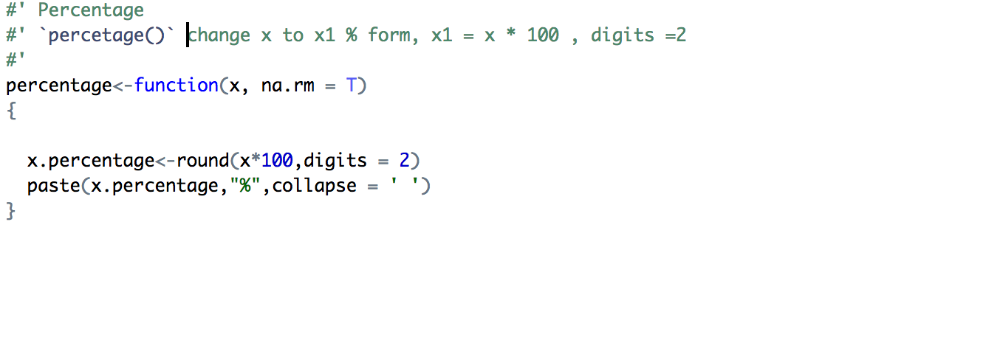
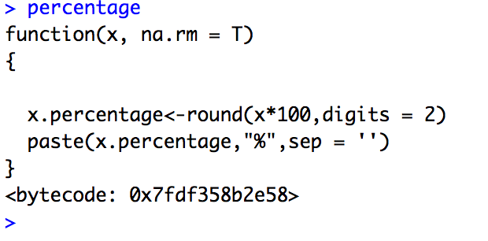
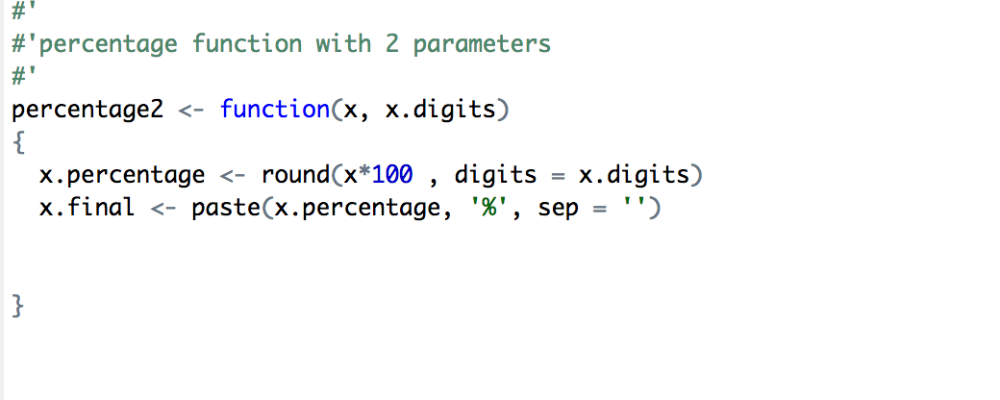

# Function



```{r}
source('./func/percentage.R')
x = c(0.3321, 0.98201, 0.521)
print(percentage(x))
```

- [x] function is also an object

{}
```{r}
source('./func/percentage2.R')
x = c(0.3321, 0.98201, 0.521)
print(percentage2(x,3))
```
{}
